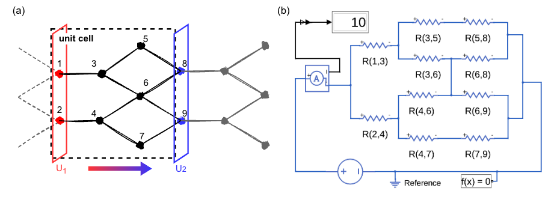

# CrystalCircuit

The code for mapping crystal networks to electrical circuits, which can be used to estimate the thermal conductivity of structures. The generated script can be run in the Simulink module of MATLAB (version R2024b) to measure the current through the crystal network. Note that Simscape should be installed. 

# Usage
## Requirements

 - python > 3.8
 - networkx ==  3.0
 - pymatgen == 2023.8.10

## Instructions

 - Modify the input parameters in `write_matlab.py`;
 - Run the program by `$ python write_matlab.py`;
 - Initialize the Simulink module in MATLAB; 
 - Run the generated script. 

# License

This code is under MIT License. 

# Reference
